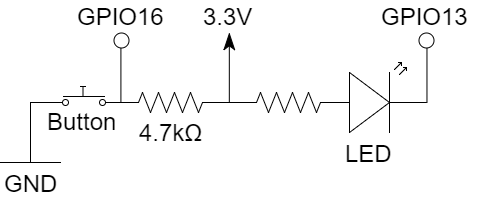

# Cloud4RPi Library and Examples for [ESP8266](https://en.wikipedia.org/wiki/ESP8266) with [MicroPython](https://micropython.org/)

[](https://travis-ci.org/cloud4rpi/cloud4rpi-esp8266-micropython)

## Running the Sample Code

1. Connect your MicroPython-enabled ESP8266 to a Wi-Fi network and configure it for [WebREPL](https://github.com/micropython/webrepl). You can do it by accessing  the console via the serial port and executing the following commands:

    ```python
    >>> from network import WLAN
    >>> STA = WLAN(0); STA.active(1)
    >>> STA.connect('__SSID__', '__PASSWORD__')
    >>> STA.ifconfig()  # Outputs the network configuration. If it is not valid, wait and re-execute
    ```

2. Download the [MQTT library](https://github.com/micropython/micropython-lib/blob/master/umqtt.simple/umqtt/simple.py) and upload it to your ESP8266 with the name `mqtt.py` using the **WebREPL**.
3. Clone this repository or download [cloud4rpi.py](cloud4rpi.py) and the [main.py](main.py) files.
4. [Log into your Cloud4RPi account](https://cloud4rpi.io/signin) or [create a new one](https://cloud4rpi.io/register).
5. Copy [your device](https://cloud4rpi.io/devices)'s **Device Token**.
4. Edit the [main.py](main.py) file. Enter your Wi-Fi network data and paste the **Device Token** into the required variables.
11. Connect the LED to GPIO12 and a button to GPIO16. If you need to use other pins, change the corresponding variables in [main.py](main.py).

    

5. Transfer the [cloud4rpi.py](cloud4rpi.py) and edited [main.py](main.py) files to your ESP8266.
6. Reset the ESP8266. You can use the console for this:

    ```python
    >>> import machine
    >>> machine.reset()
    ```

8. Check that the [device](https://cloud4rpi.io/devices) goes online and starts sending data.
9. Go to the [Control Panels](https://cloud4rpi.io/control-panels/) page and add a new control panel.
10. Add two **Switch** widgets and bind them to the `LED` variable.
11. Add a new **Text** widget and bind it to the `Button` variable. Configure different colors for the "true" and "false" strings.

You can use this control panel to control the LED and see when the button is pressed.


## See Also

* [Examples for Raspberry Pi](https://github.com/cloud4rpi/cloud4rpi-raspberrypi-python)
* [Examples for Next Thing Co. C.H.I.P.](https://github.com/cloud4rpi/cloud4rpi-chip-python)
* [Examples for Onion Omega2](https://github.com/cloud4rpi/cloud4rpi-omega2-python)
* [Documentation Repository](https://github.com/cloud4rpi/docs)
